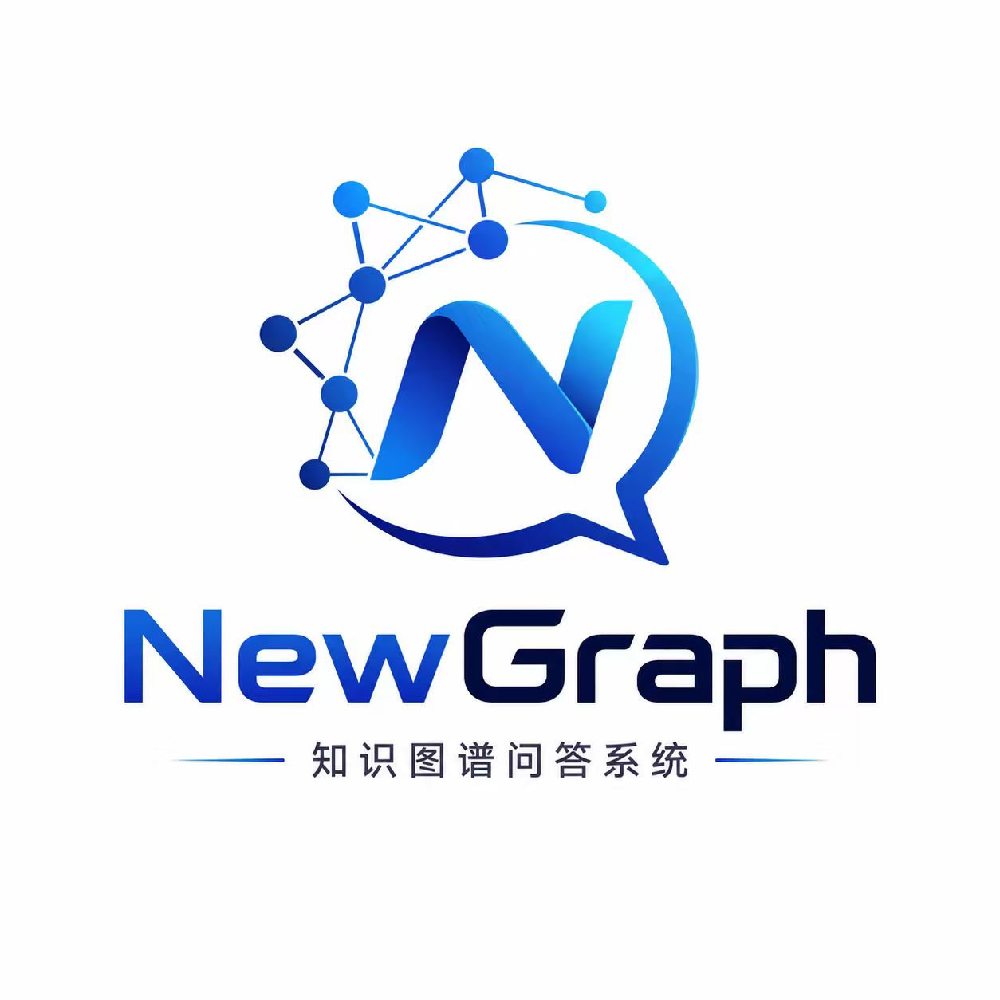
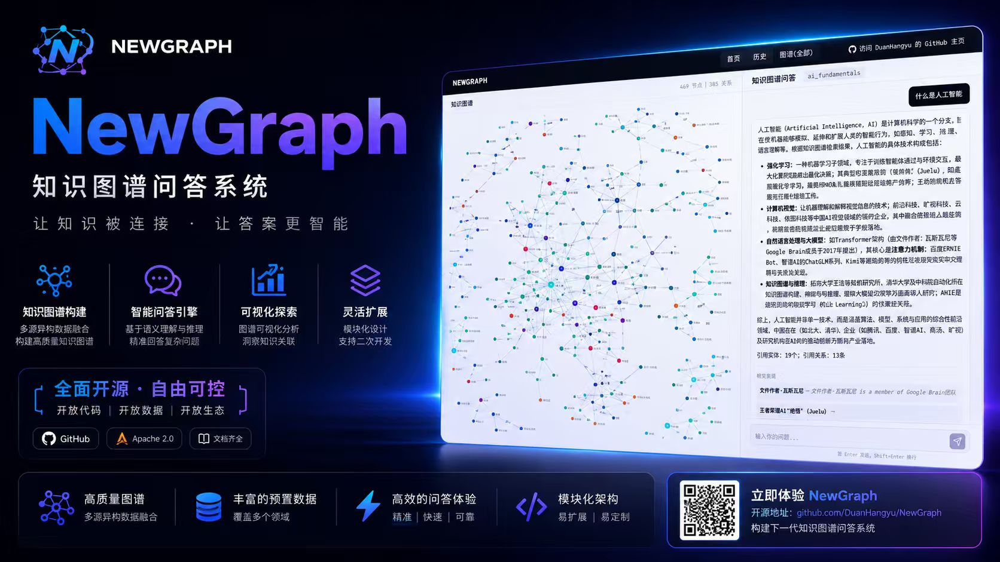
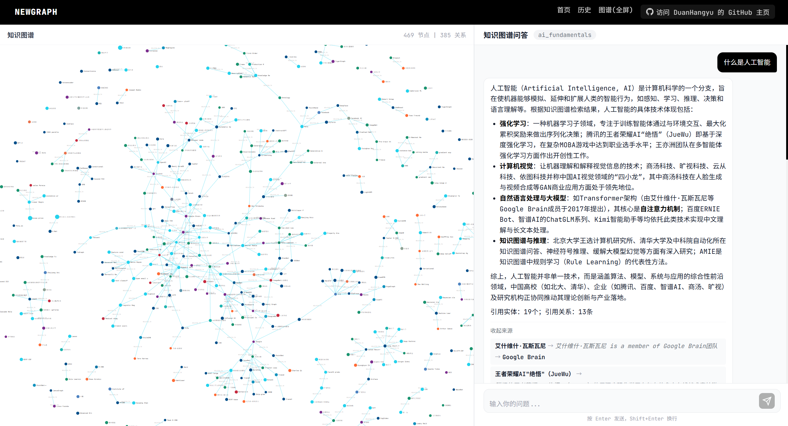
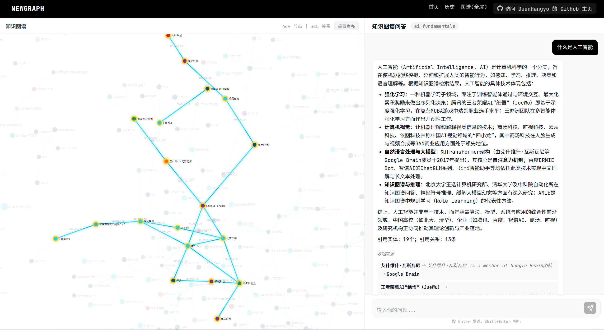
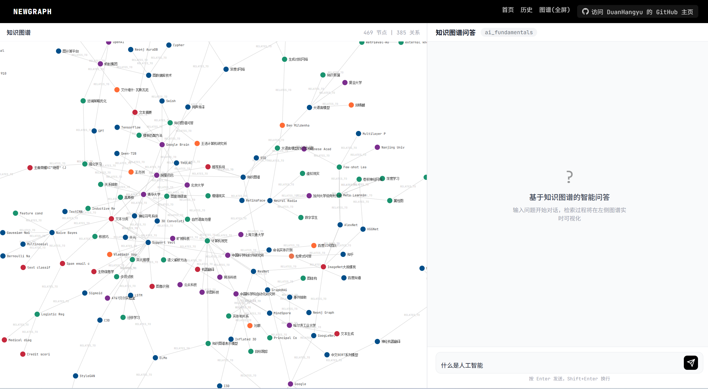
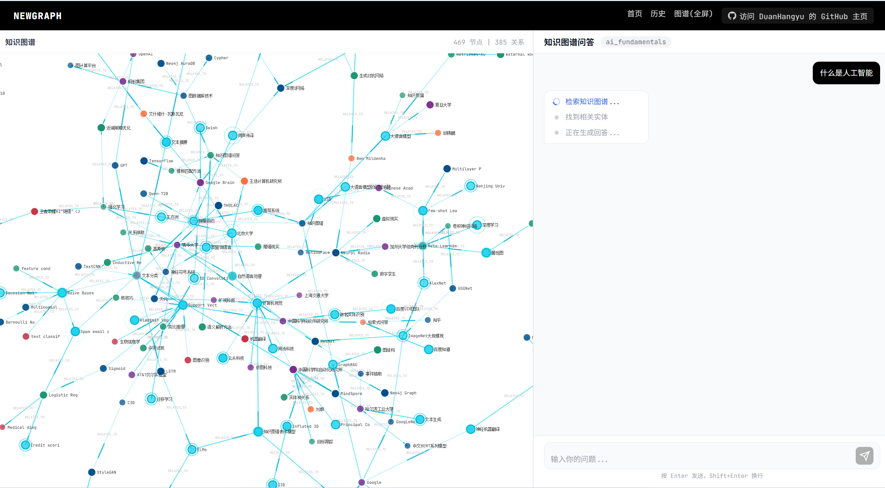

<div align="center">



# NewGraph

**基于 LLM + Neo4j 的多模式知识图谱平台**

PBL 学习路径构建 · Graphiti 知识图谱问答 · AI 虚拟课堂

[](LICENSE)
[](https://vuejs.org/)
[](https://flask.palletsprojects.com/)
[](https://neo4j.com/)
[](https://github.com/getzep/graphiti)

</div>

---



---

## 功能特性

NewGraph 集成两大核心模式，覆盖知识图谱的构建、可视化与智能问答全流程。

### 模式一：PBL 学习路径构建

上传课程文档或输入课程描述，LLM 自动提取 **项目驱动 + 环形知识链** 的学习路径图谱，可视化展示并支持 AI 虚拟课堂生成。

- **智能提取** — LLM 自动识别项目序列、知识点及前置关系，构建结构化学习路径
- **双视图可视化** — D3.js 力导向全图视图 + 分层学习路径视图，支持缩放、拖拽、节点聚焦
- **AI 虚拟课堂** — 每个知识点可一键生成 OpenMAIC 沉浸式 AI 课堂（支持播客双人对话模式）
- **学习工作台** — 里程碑进度追踪、知识点学习提示（简略/详细两级）、环形知识链导航

### 模式二：Graphiti 知识图谱问答（KGQA）

导入预设数据集或上传自定义文件，Graphiti SDK 自动提取实体与关系，构建知识图谱后支持**混合检索 + LLM 生成**的智能问答。

- **预设数据集** — 内置 AI 基础领域、AI 前沿技术、量子计算三大主题数据集，一键导入
- **自动图谱构建** — Graphiti SDK 自动提取实体（技术、研究者、机构、概念、应用）及其关系
- **混合检索问答** — 向量相似度 + 图遍历混合搜索，结合 LLM 生成带来源引用的回答
- **图谱 + 问答联动** — 左侧图谱可视化，右侧对话问答，回答自动高亮图谱中的相关节点
- **流式输出** — 支持 SSE 流式响应，实时生成回答

---

## 界面展示

<table>
  <tr>
    <td align="center"><b>知识图谱可视化</b></td>
    <td align="center"><b>图谱问答联动</b></td>
  </tr>
  <tr>
    <td></td>
    <td></td>
  </tr>
  <tr>
    <td align="center"><b>PBL 学习工作台</b></td>
    <td align="center"><b>数据集管理</b></td>
  </tr>
  <tr>
    <td></td>
    <td></td>
  </tr>
</table>

> 演示视频：[`images/知识图谱问答.mp4`](images/知识图谱问答.mp4)

---

## 系统架构

```
┌─────────────────────────────────────────────────────────┐
│                    Vue 3 前端 (SPA)                      │
│  D3.js 可视化 · Vue Router · I18n · Axios · Markdown    │
└──────────────────────┬──────────────────────────────────┘
                       │ REST API / SSE
┌──────────────────────▼──────────────────────────────────┐
│                   Flask 后端 (Python)                     │
│                                                          │
│  ┌──────────────┐  ┌───────────────┐  ┌──────────────┐  │
│  │ PBL 图谱提取  │  │ Graphiti 服务  │  │  QA 问答管道  │  │
│  │ graph_extractor│ │graphiti_service│ │  qa_service   │  │
│  └──────┬───────┘  └───────┬───────┘  └──────┬───────┘  │
│         │                  │                  │           │
│  ┌──────▼──────────────────▼──────────────────▼───────┐  │
│  │          LLM Client (OpenAI 兼容格式)               │  │
│  └────────────────────────────────────────────────────┘  │
│         │                  │                             │
└─────────┼──────────────────┼─────────────────────────────┘
          │                  │
   ┌──────▼──────┐   ┌──────▼──────┐
   │   Neo4j     │   │  OpenMAIC   │
   │  图谱存储    │   │ 虚拟课堂引擎 │
   └─────────────┘   └─────────────┘
```

---

## 快速开始

### 环境要求

| 工具 | 版本 | 说明 | 验证命令 |
|------|------|------|----------|
| **Node.js** | >= 18 | 前端运行环境 | `node -v` |
| **Python** | >= 3.11, <= 3.12 | 后端运行环境 | `python --version` |
| **uv** | 最新版 | Python 包管理器 | `uv --version` |

### 1. 配置环境变量

```bash
cp .env.example .env
```

编辑 `.env` 文件，填入以下必需配置：

```env
# LLM API（支持 OpenAI SDK 兼容格式的任意 LLM）
# 推荐：阿里百炼 qwen-plus https://bailian.console.aliyun.com/
LLM_API_KEY=your_api_key
LLM_BASE_URL=https://dashscope.aliyuncs.com/compatible-mode/v1
LLM_MODEL_NAME=qwen-plus

# Neo4j（二选一）
# 选项 A：AuraDB 云托管（推荐，有免费层）https://neo4j.com/cloud/aura/
NEO4J_URI=neo4j+s://xxx.databases.neo4j.io
NEO4J_USER=neo4j
NEO4J_PASSWORD=your_password

# 选项 B：本地 Docker（docker compose up -d）
# NEO4J_URI=bolt://localhost:7687
```

可选配置：

```env
# 加速 LLM（用于特定任务）
LLM_BOOST_API_KEY=your_key
LLM_BOOST_BASE_URL=https://...
LLM_BOOST_MODEL_NAME=your_model

# OpenMAIC 虚拟课堂
OPENMAIC_BASE_URL=http://localhost:3001
OPENMAIC_DIR=F:\AI Projects\OpenMAIC
```

### 2. 安装依赖

```bash
# 一键安装所有依赖
npm run setup:all
```

### 3. 启动服务

```bash
# 前后端同时启动
npm run dev

# 前后端 + OpenMAIC 虚拟课堂
npm run dev:all

# 单独启动
npm run backend    # 后端 http://localhost:5001
npm run frontend   # 前端 http://localhost:3000
```

### Docker 部署

```bash
cp .env.example .env
docker compose up -d
```

包含本地 Neo4j 容器，前端映射 `3000` 端口，后端映射 `5001` 端口。

---

## 项目结构

```
Newgraph/
├── backend/                        # Flask API 服务 (Python)
│   ├── app/
│   │   ├── api/                    # 路由蓝图
│   │   │   ├── graph.py            # PBL 图谱提取/存储/查询
│   │   │   ├── qa.py               # KGQA 问答 (SSE 流式)
│   │   │   ├── data.py             # 数据集导入/上传
│   │   │   ├── classroom.py        # OpenMAIC 课堂集成
│   │   │   └── hint.py             # 学习提示生成
│   │   ├── services/               # 核心业务逻辑
│   │   │   ├── graph_extractor.py  # PBL 图谱提取 (LLM)
│   │   │   ├── graphiti_service.py # Graphiti SDK 封装
│   │   │   ├── qa_service.py       # QA 管道：检索→组装→生成
│   │   │   ├── neo4j_operations.py # Neo4j CRUD
│   │   │   ├── data_loader.py      # 数据集导入编排
│   │   │   └── hint_service.py     # 学习提示生成
│   │   ├── models/                 # 数据模型 (JSON 文件持久化)
│   │   ├── utils/                  # 工具类
│   │   │   ├── llm_client.py       # LLM 客户端 (JSON 修复)
│   │   │   ├── async_bridge.py     # asyncio↔Flask 桥接
│   │   │   ├── file_parser.py      # PDF/MD/TXT 解析
│   │   │   └── text_processor.py   # 文本规范化
│   │   └── config.py               # 环境变量配置
│   ├── data/datasets/              # 预设数据集目录
│   └── run.py
├── frontend/                       # Vue 3 SPA
│   └── src/
│       ├── views/                  # 页面组件
│       │   ├── Home.vue            # 首页（数据集选择 + 文档上传）
│       │   ├── DatasetManager.vue  # 数据集管理
│       │   ├── Process.vue         # 图谱可视化 (D3.js)
│       │   ├── QAGraph.vue         # 图谱 + 问答分屏视图
│       │   ├── QA.vue              # 纯问答聊天界面
│       │   ├── ProjectWorkbench.vue# PBL 学习工作台
│       │   ├── Classroom.vue       # 虚拟课堂 (iframe)
│       │   └── History.vue         # 项目历史列表
│       ├── components/             # 可复用组件
│       │   ├── GraphPanel.vue      # D3.js 图谱面板
│       │   └── HintPanel.vue       # 学习提示面板
│       ├── composables/            # 组合式函数
│       │   └── useGraphRenderer.js # D3.js 力导向布局渲染
│       ├── api/                    # API 客户端 (Axios + retry)
│       ├── store/                  # 状态管理
│       ├── i18n/                   # 国际化 (中/英)
│       └── router/                 # Vue Router
├── images/                         # README 素材
├── docs/                           # 详细文档
└── docker-compose.yml
```

---

## 技术栈

| 层级 | 技术 | 说明 |
|------|------|------|
| **前端框架** | Vue 3 + Composition API | 渐进式 JavaScript 框架 |
| **前端路由** | Vue Router 4 | SPA 路由管理 |
| **前端国际化** | Vue I18n | 中/英文切换 |
| **图谱可视化** | D3.js v7 | 力导向布局 + 分层布局 |
| **HTTP 客户端** | Axios | 含自动重试 |
| **Markdown 渲染** | marked | QA 回答渲染 |
| **后端框架** | Flask 3.1 | Python WSGI 框架 |
| **图谱引擎** | Graphiti Core | 实体/关系自动提取 + 混合搜索 |
| **图数据库** | Neo4j 5.x | 图谱存储与查询 |
| **LLM 集成** | OpenAI SDK | 兼容格式，JSON mode，截断修复 |
| **异步桥接** | AsyncBridge | asyncio 事件循环 → Flask 同步调用 |
| **文件解析** | PyMuPDF + chardet | PDF/MD/TXT，多编码回退 |
| **外部服务** | OpenMAIC | AI 虚拟课堂生成引擎 |
| **包管理** | uv (Python) + npm (Node) | 快速依赖安装 |

---

## API 端点

### 图谱 (`/api/graph`)

| 方法 | 路径 | 说明 |
|------|------|------|
| `POST` | `/extract` | 上传文档 → LLM 提取 PBL 图谱 |
| `POST` | `/store` | 存储图谱到 Neo4j |
| `GET` | `/data/:id` | 获取 PBL 图谱数据 |
| `GET` | `/graphiti-data/:id` | 获取 Graphiti 图谱数据 |
| `GET` | `/learning-path/:id` | 获取学习路径结构 |
| `GET` | `/milestones/:id` | 获取里程碑 + 知识点 |
| `GET` | `/project/list` | 列出所有项目 |
| `DELETE` | `/project/:id` | 删除项目 |

### 问答 (`/api/qa`)

| 方法 | 路径 | 说明 |
|------|------|------|
| `POST` | `/ask` | 提问（非流式） |
| `POST` | `/ask-stream` | 提问（SSE 流式） |
| `GET` | `/history/:id` | 获取会话历史 |
| `DELETE` | `/history/:id` | 清除会话 |

### 数据集 (`/api/data`)

| 方法 | 路径 | 说明 |
|------|------|------|
| `GET` | `/presets` | 列出预设数据集 |
| `POST` | `/ingest` | 导入预设数据集（异步） |
| `POST` | `/upload` | 上传自定义文件（异步） |
| `GET` | `/ingest-status/:id` | 查询导入进度 |

### 课堂 (`/api/classroom`)

| 方法 | 路径 | 说明 |
|------|------|------|
| `POST` | `/generate` | 生成虚拟课堂 |
| `GET` | `/status/:id` | 查询生成状态 |
| `POST` | `/cache` | 缓存课堂 ID 到 Neo4j |

---

## 预设数据集

| 数据集 | 显示名 | 文件数 | 内容 |
|--------|--------|--------|------|
| `ai_fundamentals` | AI 基础领域 | 5 | 机器学习、深度学习、计算机视觉、自然语言处理、知识图谱 |
| `ai_frontier` | AI 前沿技术 | 4 | 大语言模型、多模态 AI、前沿技术、中国 AI 产业 |
| `quantum_computing` | 量子计算 | 2 | 量子计算基础、中国量子发展 |

导入后 Graphiti SDK 自动提取以下实体类型：`Technology`、`Researcher`、`Organization`、`Concept`、`Application`。

---

## 常见问题

<details>
<summary><b>Neo4j 连接超时怎么办？</b></summary>

- AuraDB 云端可能因网络延迟较高导致超时，系统已优化连接池配置
- 网络不稳定时建议使用本地 Docker 部署：`docker compose up -d`
- 确认 `.env` 中的连接信息正确（URI、用户名、密码）

</details>

<details>
<summary><b>LLM 图谱提取质量不佳？</b></summary>

- 提供更详细的课程描述，包含明确的学习目标和知识范围
- 上传补充文档（PDF/MD/TXT）作为额外上下文
- 推荐使用 `qwen-plus` 或同等能力的模型，较弱的模型可能导致结构不完整

</details>

<details>
<summary><b>虚拟课堂音频无法播放？</b></summary>

- 确认使用 `npm run dev:all` 同时启动了 OpenMAIC 服务
- 跨域 iframe 音频需要配置 4 项权限，详见 [OpenMAIC 集成文档](docs/OPENMAIC_INTEGRATION.md)
- 确保 iframe 的 `allow` 属性包含 `autoplay 'src'`

</details>

<details>
<summary><b>KGQA 问答回答不准确？</b></summary>

- 确保数据集已完整导入（在数据集管理页面查看导入状态）
- Graphiti 混合搜索依赖实体和关系的完整度，数据越丰富回答越准确
- 尝试更具体的提问，避免过于宽泛的问题

</details>

<details>
<summary><b>播客模式回退为单人 TTS？</b></summary>

- 需在 OpenMAIC 端 `.env.local` 配置火山引擎凭证（`PODCAST_VOLCENGINE_APP_ID`、`PODCAST_VOLCENGINE_ACCESS_KEY`）
- 这是自动回退机制，课堂内容不受影响

</details>

---

## 文档

| 文档 | 说明 |
|------|------|
| [功能文档](docs/FEATURES.md) | 详细功能说明与数据模型 |
| [API 接口文档](docs/API.md) | 完整请求/响应示例 |
| [架构文档](docs/ARCHITECTURE.md) | 代码架构、数据流、LLM 提示工程 |
| [OpenMAIC 集成](docs/OPENMAIC_INTEGRATION.md) | 跨域 iframe、音频架构、播客模式 |
| [AuraDB 配置](docs/AURADB_SETUP.md) | Neo4j 云托管配置指南 |

---

## 许可证

本项目基于 [AGPL-3.0](LICENSE) 许可证开源。
